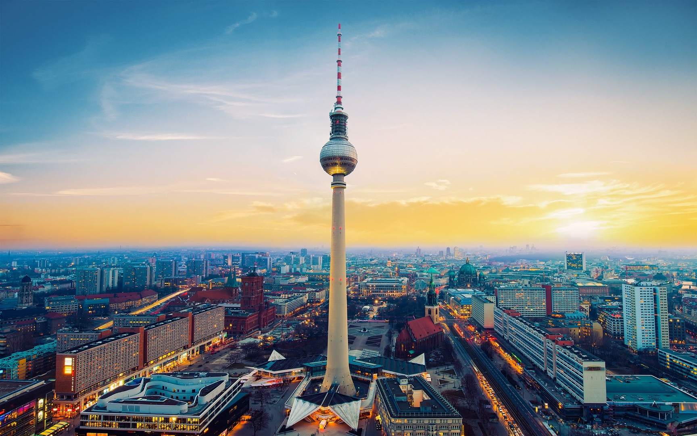
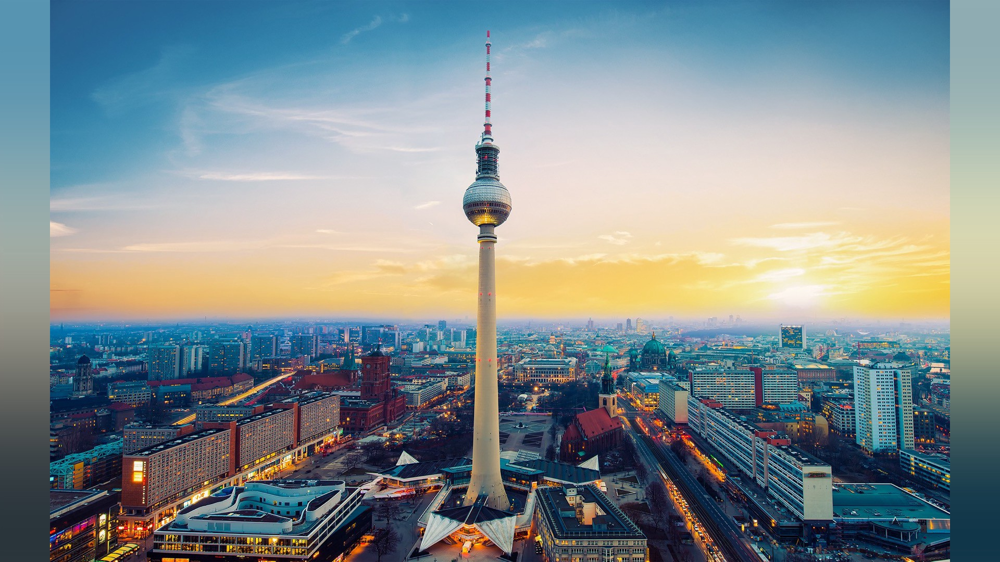

# Blurred Image Border

Package `github.com/htdvisser/bbd` resizes an image and adds blurred image borders to make the image fit the target ratio.

**Before (1728x1080):**

**After (1920x1080):**

[_image source_](https://interfacelift.com/wallpaper/details/4057/after_work.html)
